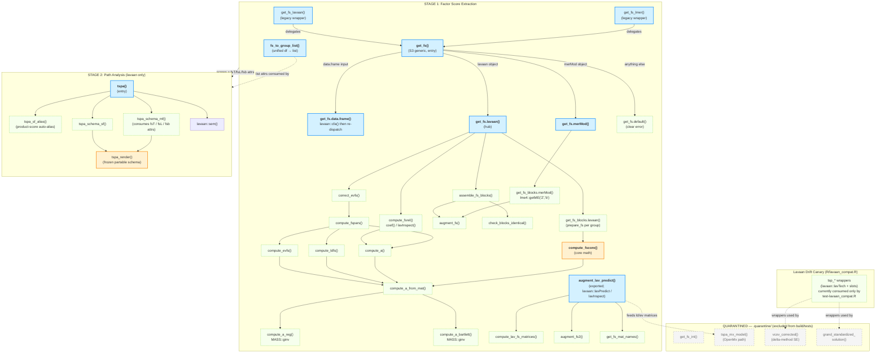

# R2spa Package Dependency Analysis

## Exported Functions — Dependency Map

### 1. `get_fs()`  (get_fscore.R:58)
**Purpose:** Main entry point for factor-score extraction from raw data.
- **External deps:** `lavaan::cfa`, `stats::setNames`
- **Internal calls:** `get_fs_lavaan()`
- **Central:** YES — primary entry for the Stage 1 pipeline

### 2. `get_fs_lavaan()`  (get_fscore.R:83)
**Purpose:** Factor-score extraction from a fitted lavaan object.
- **External deps:** `lavaan::lavInspect`
- **Internal calls:** `compute_fscore()`, `augment_fs()`, `correct_evfs()`, `vcov_ld_evfs()`, `compute_fsrel()`
- **Central:** YES — orchestration hub for factor-score computation

### 3. `compute_fscore()`  (get_fscore.R:588)
**Purpose:** Core factor-score computation from model matrices.
- **External deps:** none (bare matrix ops, `MASS::ginv` via `compute_a_reg`/`compute_a_bartlett`)
- **Internal calls:** `compute_a_from_mat()` → `compute_a_reg()` / `compute_a_bartlett()`
- **Central:** YES — mathematical core, called by `get_fs_lavaan`, externally exportable

### 4. `augment_lav_predict()`  (get_fscore.R:467)
**Purpose:** Factor-score extraction via `lavaan::lavPredict()` (alternative path for OpenMx workflow).
- **External deps:** `lavaan::lavPredict`, `lavaan::lavInspect`
- **Internal calls:** `compute_lav_fs_matrices()`, `augment_fs2()`, `get_fs_mat_names()`
- **Central:** SECONDARY — feeds into `tspa_mx_model` workflow

### 5. `get_fs_lmer()`  (get_fscore.R:284)
**Purpose:** Factor scores from `lme4` mixed models.
- **External deps:** `lme4::getME`, `lme4::ranef`, `Matrix::crossprod`, `Matrix::solve`, `Matrix::t`, `Matrix::tcrossprod`
- **Internal calls:** `get_fsLT_lmer()`, `create_fsT_names()`, `create_fsL_names()`
- **Central:** NO — standalone lme4 pathway

### 6. `tspa()`  (tspa.R:121)
**Purpose:** Main Stage 2 path-analysis entry point.
- **External deps:** `lavaan::sem`
- **Internal calls:** `tspa_sf()` (single-factor), `tspa_mf()` (multi-factor)
- **Central:** YES — primary entry for Stage 2

### 7. `vcov_corrected()`  (tspa_corrected_se.R:16)
**Purpose:** Delta-method SE correction for 2S-PA results.
- **External deps:** `lavaan::lav_func_jacobian_complex`, `lavaan::lav_matrix_lower2full`, `lavaan::coef`, `lavaan::vcov`, `lavaan::lavInspect`
- **Internal calls:** `update_tspa()`
- **Central:** NO — post-hoc correction, depends on `tspa()` output

### 8. `tspa_mx_model()`  (tspa_mx.R:152)
**Purpose:** Build an OpenMx definition-variable 2S-PA model (a single-level RAM assembled from `lavaan::lavaanify`).
- **External deps:** `OpenMx::mxModel`, `OpenMx::mxData`, `OpenMx::mxPath`, `OpenMx::mxFitFunctionML`, `OpenMx::mxRun` — all guarded by `require_openmx()`. `OpenMx` is a `Suggests` (optional), **not** an `Import`; the `lavaan`-based `tspa()` route does not need it.
- **Internal calls:** `tspa_mx_spec()`, `tspa_mx_derive_measurement()`, `tspa_mx_model_string()`, `lav_to_mx_ram()`, `tspa_mx_paths()`, `tspa_mx_defvar_col()`, `require_openmx()`
- **Central:** NO — alternative (optional) OpenMx pathway

### 9. `tspa_plot()`  (tspa_plot.R:55)
**Purpose:** Diagnostic scatterplots and residual plots.
- **External deps:** `grDevices::devAskNewPage`, `lavaan::parameterestimates`, `lavaan::lavInspect`, `lavaan::lavPredict`, `lavaan::lavPredictY`
- **Internal calls:** `plot_scatter()`, `plot_residual()`
- **Central:** NO — visualization, depends on `tspa()` output

### 10. `grandStandardizedSolution()` / `grand_standardized_solution()`  (grandStandardizedSolution.R:81)
**Purpose:** Grand-standardized parameter estimates with SEs for multigroup models.
- **External deps:** `lavaan::lavTech`, `lavaan::lavInspect`, `lavaan::vcov`, `lavaan::lav_func_jacobian_complex`, `stats::pnorm`, `stats::qnorm`, `utils::tail`
- **Internal calls:** `std_beta_est()`, `grand_std_beta_est()`, `veta()`, `veta_grand()`, `eeta()`, `.fill_matrix_list()`, `.combine_est()`
- **Central:** NO — post-hoc standardization utility (works on any lavaan object)

### 11. `get_fs_int()`  (get_fs_int.R:45)
**Purpose:** Product indicators for latent interactions.
- **External deps:** `utils::combn`
- **Internal calls:** `check_inputs()`
- **Central:** NO — add-on for interaction terms, feeds into `tspa()`

### 12. `block_diag()`  (helper.R:4)
**Purpose:** Create block-diagonal matrix from multiple square matrices.
- **External deps:** none
- **Internal calls:** none
- **Central:** NO — standalone utility

---

## Internal (Unexported) Functions

| Function | File | Called By |
|---|---|---|
| `augment_fs()` | get_fscore.R | `get_fs_lavaan()` |
| `augment_fs2()` | get_fscore.R | `augment_lav_predict()` |
| `check_inputs()` | get_fs_int.R | `get_fs_int()` |
| `compute_a()` | get_fscore.R | `correct_evfs()`, `compute_fsrel()` |
| `compute_a_bartlett()` | get_fscore.R | `compute_a_from_mat()` |
| `compute_a_from_mat()` | get_fscore.R | `compute_fscore()`, `compute_fspars()` |
| `compute_a_reg()` | get_fscore.R | `compute_a_from_mat()` |
| `compute_dfs()` | get_fscore.R | `compute_fspars()` |
| `compute_evfs()` | get_fscore.R | `compute_grad_ld_evfs()` |
| `compute_fsrel()` | get_fscore.R | `get_fs_lavaan()` |
| `compute_fspars()` | get_fscore.R | (orchestrates a/evfs/ldfs) |
| `compute_grad_ld_evfs()` | get_fscore.R | `vcov_ld_evfs()` |
| `compute_ldfs()` | get_fscore.R | `compute_grad_ld_evfs()` |
| `compute_lav_fs_matrices()` | get_fscore.R | `augment_lav_predict()` |
| `correct_evfs()` | get_fscore.R | `get_fs_lavaan()` |
| `create_fsL_names()` | get_fscore.R | `get_fs_lmer()`, `get_fs_mat_names()` |
| `create_fsT_names()` | get_fscore.R | `get_fs_lmer()`, `get_fs_mat_names()` |
| `eeta()` | grandStd.R | `veta_grand()` |
| `get_D()` | get_fscore.R | `get_fsLT_lmer()` |
| `get_fsLT()` | get_fscore.R | `get_fsLT_lmer()` |
| `get_fsLT_lmer()` | get_fscore.R | `get_fs_lmer()` |
| `get_fs_mat_names()` | get_fscore.R | `augment_lav_predict()` |
| `make_mx_int()` | tspa_mx.R | `tspa_mx_model()` |
| `make_mx_ld()` | tspa_mx.R | `tspa_mx_model()` |
| `make_mx_vc()` | tspa_mx.R | `tspa_mx_model()` |
| `plot_residual()` | tspa_plot.R | `tspa_plot()` |
| `plot_scatter()` | tspa_plot.R | `tspa_plot()` |
| `sqrt_or_na()` | get_fscore.R | `augment_fs2()` |
| `tspa_mf()` | tspa.R | `tspa()` |
| `tspa_sf()` | tspa.R | `tspa()` |
| `update_tspa()` | tspa_corr.R | `vcov_corrected()` |
| `veta()` | grandStd.R | `std_beta_est()`, `veta_grand()` |
| `veta_grand()` | grandStd.R | `grand_std_beta_est()` |
| `vcov_ld_evfs()` | get_fscore.R | `get_fs_lavaan()` |
| `.combine_est()` | grandStd.R | `grand_standardized_solution()` |
| `.fill_matrix_list()` | grandStd.R | `std_beta_est()`, `grand_std_beta_est()` |

---

## Dependency Diagram (Mermaid)

```mermaid
flowchart TD
    subgraph STAGE_1["STAGE 1: Factor Score Extraction"]
        direction TB

        get_fs["<b>get_fs()</b><br/>(entry)"] -->|calls| get_fs_lavaan["<b>get_fs_lavaan()</b><br/>(hub)"]

        get_fs_lavaan --> compute_fscore["<b>compute_fscore()</b><br/>(core math)"]
        get_fs_lavaan --> augment_fs["augment_fs()"]
        get_fs_lavaan --> correct_evfs["correct_evfs()"]
        get_fs_lavaan --> vcov_ld_evfs["vcov_ld_evfs()"]
        get_fs_lavaan --> compute_fsrel["compute_fsrel()"]

        compute_fscore --> compute_a_from_mat["compute_a_from_mat()"]
        compute_a_from_mat --> compute_a_reg["compute_a_reg()<br/>MASS::ginv"]
        compute_a_from_mat --> compute_a_bartlett["compute_a_bartlett()<br/>MASS::ginv"]

        correct_evfs --> compute_a["compute_a()"] --> compute_a_from_mat
        vcov_ld_evfs --> compute_grad["compute_grad_ld_evfs()"]
        compute_grad --> compute_evfs["compute_evfs()"] --> compute_fspars["compute_fspars()"]
        compute_grad --> compute_ldfs["compute_ldfs()"] --> compute_fspars
        compute_fsrel --> compute_a

        augment_lav["<b>augment_lav_predict()</b>"] --> clfm["compute_lav_fs_matrices()"]
        augment_lav --> augs2["augment_fs2()"]
        augment_lav --> gfmn["get_fs_mat_names()"]

        get_fs_lmer["<b>get_fs_lmer()</b>"] --> gfLL["get_fsLT_lmer()"]
        gfLL --> getD["get_D()"]
        gfLL --> gfLT["get_fsLT()"]
        get_fs_lmer --> cfsT["create_fsT_names()"]
        get_fs_lmer --> cfsL["create_fsL_names()"]
    end

    subgraph STAGE_2["STAGE 2: Path Analysis"]
        tspa["<b>tspa()</b><br/>(entry)"] --> tspa_sf["tspa_sf()"]
        tspa --> tspa_mf["tspa_mf()"]
        tspa_sf --> sem["lavaan::sem()"]
        tspa_mf --> sem

        vcov_corrected["<b>vcov_corrected()</b>"] --> upd["update_tspa()"] --> tspa
        vcov_corrected --> jacob["lavaan::lav_func_jacobian_complex()"]

        tspa_mx["<b>tspa_mx_model()</b>"] --> mxld["make_mx_ld()"]
        tspa_mx --> mxvc["make_mx_vc()"]
        tspa_mx --> mxint["make_mx_int()"]

        augment_lav -.->|feeds| tspa_mx
    end

    subgraph POSTHOC["Post-Hoc & Utilities"]
        gss["<b>grand_standardized_<br/>solution()</b>"] --> stbe["std_beta_est()"]
        gss --> gsb["grand_std_beta_est()"]
        stbe --> vetaF["veta()"]
        gsb --> vg["veta_grand()"] --> vetaF
        gsb --> eetaF["eeta()"]
        vg --> eetaF

        fsint["<b>get_fs_int()</b>"] --> chk["check_inputs()"]
        fsint -.->|product ind.| tspa

        tpl["<b>tspa_plot()</b>"] --> psc["plot_scatter()"]
        tpl --> prs["plot_residual()"]
        tspa -.->|output| tpl

        bld["<b>block_diag()</b>"]
    end

    classDef exported fill:#d4f1ff,stroke:#1890ff,stroke-width:2px
    classDef core fill:#fff1d0,stroke:#fa8c16,stroke-width:2px
    classDef internal fill:#f6ffed,stroke:#52c41a,stroke-width:1px,stroke-dasharray: 3 3

    class get_fs,get_fs_lavaan,compute_fscore,augment_lav,get_fs_lmer,tspa,vcov_corrected,tspa_mx,augment_lav,gss,fsint,tpl,bld exported
    class compute_fscore,tspa core
```



---

## Architecture Summary

```
                        External Packages
       ┌──────────┬──────────┬───────────┬──────────┬─────────┐
       │  lavaan  │   lme4   │   MASS    │  Matrix  │ OpenMx  │
       └────┬─────┴────┬─────┴─────┬─────┴────┬─────┴───┬─────┘
            │           │           │         │         │
            ▼           ▼           ▼         ▼         ▼
    ┌─────────────────────────────────────────────────────────┐
    │              STAGE 1 — Factor Score Extraction           │
    │                                                         │
    │  get_fs ──────────────────────────────────► get_fs_lavaan│
    │  get_fs_lmer ───► get_fsLT_lmer             │           │
    │  augment_lav_predict                        ▼           │
    │                                        compute_fscore   │
    │                                   (the mathematical     │
    │                                    core of the package)  │
    └────────────────────────────┬────────────────────────────┘
                                 │ factor scores + fsT/fsL
                                 ▼
    ┌─────────────────────────────────────────────────────────┐
    │              STAGE 2 — Path Analysis                     │
    │                                                         │
    │  tspa ──► lavaan::sem   │  tspa_mx_model ──► OpenMx     │
    └─────────────────────────┬───────────────────────────────┘
                              │ fitted model
                              ▼
    ┌─────────────────────────────────────────────────────────┐
    │              POST-HOC ANNOTATION                         │
    │                                                         │
    │  vcov_corrected  │  grand_standardized_solution         │
    │  get_fs_int      │  tspa_plot                           │
    │  block_diag      │                                      │
    └──────────────────┴──────────────────────────────────────┘
```

**Central functions:** `get_fs_lavaan()` (stage-1 orchestration), `compute_fscore()` (mathematical core), `tspa()` (stage-2 entry). These three form the backbone: data → factor scores → path model.

---

## Post-Quarantine Dependency Map (2026-08-17)

> Everything above this line is the **pre-quarantine** state, preserved for
> historical reference. Since 2026-08-17 (plan: `archive/PLAN_QUARANTINE.md`),
> all in-package code that **consumes** `get_fs()` / `tspa()` has been moved to
> `.quarantine/{R,tests,vignettes}/` while the `get_fs()`/`tspa()` contracts are
> under revision. The quarantined files remain functional and self-contained;
> restore by `git mv`-ing them back, then `document()` → `test()` → `check()`.

### What left the package

- **Exports removed from `NAMESPACE`:** `get_fs_int`, `tspa_mx_model`,
  `vcov_corrected`, `grand_standardized_solution`,
  `grandStandardizedSolution`.
- **`.quarantine/R/`:** `get_fs_int.R`, `tspa_mx.R`, `tspa_corrected_se.R`,
  `grandStandardizedSolution.R`.
- **`.quarantine/tests/`:** `test-get_fs_int.R`, `test-grandStandardizedSolution.R`
  (each with the sections extracted from other test files appended, provenance
  headers included) + 2 new self-contained files `test-tspa_mx.R` and
  `test-vcov_corrected.R` (extracted Mx / corrected-SE blocks + copied setups).
- **`.quarantine/vignettes/`:** `get_fs_int-vignette.Rmd`,
  `categorical-interaction.Rmd`, `reliability.Rmd`, `corrected-se.Rmd`,
  `tspa-vignette-mx.Rmd`, `missing-data.Rmd`, `multilevel.rmd`,
  `gr-std-coef.Rmd` + fixtures `sim_results_reliability.RDS`, `boo_joint.RDS`,
  `boo_separate.RDS` (+ their untracked `.html` builds).
- **Imports that left `NAMESPACE`:** `OpenMx` (6 fns; `tspa_mx.R` was the only
  consumer), `stats::pnorm`/`qnorm`, `utils::combn`/`tail`,
  `lavaan::lav_func_jacobian_complex` (bare calls in staying code are covered by
  the re-declared `importFrom(lavaan, vcov)` plus namespaced calls). `OpenMx`
  **stays in `DESCRIPTION: Imports`** until re-integration — hence exactly one
  check NOTE (`'OpenMx' in Imports but not imported from`), expected and
  accepted.
- **`R/lavaan_compat.R`** (`tsp_*` lavaan-drift canary) **stays** but is now
  unconsumed by package code (its only consumers were `tspa_corrected_se.R` and
  `grandStandardizedSolution.R`, both quarantined) — it is exercised solely by
  its canary tests, `tests/testthat/test-lavaan_compat.R`. Kept by user decision.

### Surviving exports (8 + 4 S3 methods)

`get_fs()` (+ `.data.frame`, `.lavaan`, `.merMod`, `.default`),
`get_fs_lavaan()`, `get_fs_lmer()` (legacy wrappers), `compute_fscore()`,
`augment_lav_predict()`, `fs_to_group_list()`, `block_diag()`, `tspa()`.

`R/` now holds 7 files (~2,500 lines): `get_fscore.R`, `get_fs_methods.R`,
`get_fscore_math.R`, `tspa.R`, `lavaan_compat.R`, `helper.R`, `globals.R`;
9 test files in `tests/testthat/`; 6 vignettes in `vignettes/`.

### Post-quarantine dependency diagram (Mermaid)



### Post-quarantine architecture summary

```
                     External Packages
    ┌──────────┬──────────┬───────────┬──────────────┐
    │  lavaan  │   lme4   │   MASS    │   OpenMx     │
    │(cfa, sem,│(getME Z, │  (ginv)   │(Imports-only,│
    │ lavPredict,│  b)    │           │ unimported — │
    │ lavInspect)│        │           │ NOTE until   │
    │          │          │           │ re-integration)│
    └────┬─────┴────┬─────┴─────┬─────┴──────┬───────┘
         │          │           │            │
         ▼          ▼           ▼            ▼ (only .quarantine/R/tspa_mx.R)
 ┌─────────────────────────────────────────────────────┐
 │        STAGE 1 — Factor Score Extraction            │
 │                                                     │
 │  get_fs ─┬─► get_fs.data.frame ─► get_fs.lavaan     │
 │          ├─► get_fs.lavaan ─► get_fs_blocks.lavaan  │
 │          └─► get_fs.merMod ─► get_fs_blocks.merMod  │
 │                       │                             │
 │                       ▼                             │
 │             compute_fscore (core math)              │
 │             + correct_evfs / compute_fsrel          │
 │                                                     │
 │  augment_lav_predict (OpenMx-workflow helper)       │
 └──────────────────────────┬──────────────────────────┘
                            │ scores + fsT / fsL / fsb
                            ▼
 ┌─────────────────────────────────────────────────────┐
 │        STAGE 2 — Path Analysis (lavaan::sem)        │
 │                                                     │
 │  tspa ─► tspa_schema_sf/mf ─► tspa_render ─► sem   │
 │                                                     │
 │  (vcov_corrected / tspa_mx_model quarantined)       │
 └─────────────────────────────────────────────────────┘
```

**Central functions (unchanged):** `get_fs.lavaan()` (stage-1 orchestration),
`compute_fscore()` (mathematical core), `tspa()` (stage-2 entry). The delta-method
SE correction and grand-standardization utilities moved to `.quarantine/` with
everything else that consumes the stage-1/stage-2 output contracts.
