# R2spa Package Dependency Analysis

> **Structure:** The first section (below) is the **pre-quarantine** state
> (2026-08-17), preserved for historical reference. The current state
> (2026-08-30) is in the "Current Dependency Map" section at the end.

## Exported Functions — Dependency Map (Pre-Quarantine, Historical)

### 1. `get_fs()`  (get_fscore.R:58)
**Purpose:** Main entry point for factor-score extraction from raw data.
- **External deps:** `lavaan::cfa`, `stats::setNames`
- **Internal calls:** `get_fs_lavaan()`
- **Central:** YES — primary entry for the Stage 1 pipeline

### 2. `get_fs_lavaan()`  (get_fscore.R:83)
**Purpose:** Factor-score extraction from a fitted lavaan object.
- **External deps:** `lavaan::lavInspect`
- **Internal calls:** `compute_fscore()`, `augment_fs()`, `correct_evfs()`, `vcov_ld_evfs()`, `compute_fsrel()`
- **Central:** YES — orchestration hub for factor-score computation

### 3. `compute_fscore()`  (get_fscore.R:588)
**Purpose:** Core factor-score computation from model matrices.
- **External deps:** none (bare matrix ops, `MASS::ginv` via `compute_a_reg`/`compute_a_bartlett`)
- **Internal calls:** `compute_a_from_mat()` → `compute_a_reg()` / `compute_a_bartlett()`
- **Central:** YES — mathematical core, called by `get_fs_lavaan`, externally exportable

### 4. `augment_lav_predict()`  (get_fscore.R:467)
**Purpose:** Factor-score extraction via `lavaan::lavPredict()` (alternative path for OpenMx workflow).
- **External deps:** `lavaan::lavPredict`, `lavaan::lavInspect`
- **Internal calls:** `compute_lav_fs_matrices()`, `augment_fs2()`, `get_fs_mat_names()`
- **Central:** SECONDARY — feeds into `tspa_mx_model` workflow

### 5. `get_fs_lmer()`  (get_fscore.R:284)
**Purpose:** Factor scores from `lme4` mixed models.
- **External deps:** `lme4::getME`, `lme4::ranef`, `Matrix::crossprod`, `Matrix::solve`, `Matrix::t`, `Matrix::tcrossprod`
- **Internal calls:** `get_fsLT_lmer()`, `create_fsT_names()`, `create_fsL_names()`
- **Central:** NO — standalone lme4 pathway

### 6. `tspa()`  (tspa.R:121)
**Purpose:** Main Stage 2 path-analysis entry point.
- **External deps:** `lavaan::sem`
- **Internal calls:** `tspa_sf()` (single-factor), `tspa_mf()` (multi-factor)
- **Central:** YES — primary entry for Stage 2

### 7. `vcov_corrected()`  (tspa_corrected_se.R:16)
**Purpose:** Delta-method SE correction for 2S-PA results.
- **External deps:** `lavaan::lav_func_jacobian_complex`, `lavaan::lav_matrix_lower2full`, `lavaan::coef`, `lavaan::vcov`, `lavaan::lavInspect`
- **Internal calls:** `update_tspa()`
- **Central:** NO — post-hoc correction, depends on `tspa()` output

### 8. `tspa_mx_model()`  (tspa_mx.R:100)
**Purpose:** Build OpenMx definition-variable 2S-PA model.
- **External deps:** `OpenMx::mxModel`, `OpenMx::mxData`, `OpenMx::mxMatrix`, `OpenMx::mxAlgebraFromString`, `OpenMx::mxExpectationNormal`, `OpenMx::mxFitFunctionML`
- **Internal calls:** `make_mx_ld()`, `make_mx_vc()`, `make_mx_int()`
- **Central:** NO — alternative OpenMx pathway

### 9. `tspa_plot()`  (tspa_plot.R:55)
**Purpose:** Diagnostic scatterplots and residual plots.
- **External deps:** `grDevices::devAskNewPage`, `lavaan::parameterestimates`, `lavaan::lavInspect`, `lavaan::lavPredict`, `lavaan::lavPredictY`
- **Internal calls:** `plot_scatter()`, `plot_residual()`
- **Central:** NO — visualization, depends on `tspa()` output

### 10. `grandStandardizedSolution()` / `grand_standardized_solution()`  (grandStandardizedSolution.R:81)
**Purpose:** Grand-standardized parameter estimates with SEs for multigroup models.
- **External deps:** `lavaan::lavTech`, `lavaan::lavInspect`, `lavaan::vcov`, `lavaan::lav_func_jacobian_complex`, `stats::pnorm`, `stats::qnorm`, `utils::tail`
- **Internal calls:** `std_beta_est()`, `grand_std_beta_est()`, `veta()`, `veta_grand()`, `eeta()`, `.fill_matrix_list()`, `.combine_est()`
- **Central:** NO — post-hoc standardization utility (works on any lavaan object)

### 11. `get_fs_int()`  (get_fs_int.R:45)
**Purpose:** Product indicators for latent interactions.
- **External deps:** `utils::combn`
- **Internal calls:** `check_inputs()`
- **Central:** NO — add-on for interaction terms, feeds into `tspa()`

### 12. `block_diag()`  (helper.R:4)
**Purpose:** Create block-diagonal matrix from multiple square matrices.
- **External deps:** none
- **Internal calls:** none
- **Central:** NO — standalone utility

---

## Internal (Unexported) Functions

| Function | File | Called By |
|---|---|---|
| `augment_fs()` | get_fscore.R | `get_fs_lavaan()` |
| `augment_fs2()` | get_fscore.R | `augment_lav_predict()` |
| `check_inputs()` | get_fs_int.R | `get_fs_int()` |
| `compute_a()` | get_fscore.R | `correct_evfs()`, `compute_fsrel()` |
| `compute_a_bartlett()` | get_fscore.R | `compute_a_from_mat()` |
| `compute_a_from_mat()` | get_fscore.R | `compute_fscore()`, `compute_fspars()` |
| `compute_a_reg()` | get_fscore.R | `compute_a_from_mat()` |
| `compute_dfs()` | get_fscore.R | `compute_fspars()` |
| `compute_evfs()` | get_fscore.R | `compute_grad_ld_evfs()` |
| `compute_fsrel()` | get_fscore.R | `get_fs_lavaan()` |
| `compute_fspars()` | get_fscore.R | (orchestrates a/evfs/ldfs) |
| `compute_grad_ld_evfs()` | get_fscore.R | `vcov_ld_evfs()` |
| `compute_ldfs()` | get_fscore.R | `compute_grad_ld_evfs()` |
| `compute_lav_fs_matrices()` | get_fscore.R | `augment_lav_predict()` |
| `correct_evfs()` | get_fscore.R | `get_fs_lavaan()` |
| `create_fsL_names()` | get_fscore.R | `get_fs_lmer()`, `get_fs_mat_names()` |
| `create_fsT_names()` | get_fscore.R | `get_fs_lmer()`, `get_fs_mat_names()` |
| `eeta()` | grandStd.R | `veta_grand()` |
| `get_D()` | get_fscore.R | `get_fsLT_lmer()` |
| `get_fsLT()` | get_fscore.R | `get_fsLT_lmer()` |
| `get_fsLT_lmer()` | get_fscore.R | `get_fs_lmer()` |
| `get_fs_mat_names()` | get_fscore.R | `augment_lav_predict()` |
| `make_mx_int()` | tspa_mx.R | `tspa_mx_model()` |
| `make_mx_ld()` | tspa_mx.R | `tspa_mx_model()` |
| `make_mx_vc()` | tspa_mx.R | `tspa_mx_model()` |
| `plot_residual()` | tspa_plot.R | `tspa_plot()` |
| `plot_scatter()` | tspa_plot.R | `tspa_plot()` |
| `sqrt_or_na()` | get_fscore.R | `augment_fs2()` |
| `tspa_mf()` | tspa.R | `tspa()` |
| `tspa_sf()` | tspa.R | `tspa()` |
| `update_tspa()` | tspa_corr.R | `vcov_corrected()` |
| `veta()` | grandStd.R | `std_beta_est()`, `veta_grand()` |
| `veta_grand()` | grandStd.R | `grand_std_beta_est()` |
| `vcov_ld_evfs()` | get_fscore.R | `get_fs_lavaan()` |
| `.combine_est()` | grandStd.R | `grand_standardized_solution()` |
| `.fill_matrix_list()` | grandStd.R | `std_beta_est()`, `grand_std_beta_est()` |

---

## Dependency Diagram (Mermaid)

```mermaid
flowchart TD
    subgraph STAGE_1["STAGE 1: Factor Score Extraction"]
        direction TB

        get_fs["<b>get_fs()</b><br/>(entry)"] -->|calls| get_fs_lavaan["<b>get_fs_lavaan()</b><br/>(hub)"]

        get_fs_lavaan --> compute_fscore["<b>compute_fscore()</b><br/>(core math)"]
        get_fs_lavaan --> augment_fs["augment_fs()"]
        get_fs_lavaan --> correct_evfs["correct_evfs()"]
        get_fs_lavaan --> vcov_ld_evfs["vcov_ld_evfs()"]
        get_fs_lavaan --> compute_fsrel["compute_fsrel()"]

        compute_fscore --> compute_a_from_mat["compute_a_from_mat()"]
        compute_a_from_mat --> compute_a_reg["compute_a_reg()<br/>MASS::ginv"]
        compute_a_from_mat --> compute_a_bartlett["compute_a_bartlett()<br/>MASS::ginv"]

        correct_evfs --> compute_a["compute_a()"] --> compute_a_from_mat
        vcov_ld_evfs --> compute_grad["compute_grad_ld_evfs()"]
        compute_grad --> compute_evfs["compute_evfs()"] --> compute_fspars["compute_fspars()"]
        compute_grad --> compute_ldfs["compute_ldfs()"] --> compute_fspars
        compute_fsrel --> compute_a

        augment_lav["<b>augment_lav_predict()</b>"] --> clfm["compute_lav_fs_matrices()"]
        augment_lav --> augs2["augment_fs2()"]
        augment_lav --> gfmn["get_fs_mat_names()"]

        get_fs_lmer["<b>get_fs_lmer()</b>"] --> gfLL["get_fsLT_lmer()"]
        gfLL --> getD["get_D()"]
        gfLL --> gfLT["get_fsLT()"]
        get_fs_lmer --> cfsT["create_fsT_names()"]
        get_fs_lmer --> cfsL["create_fsL_names()"]
    end

    subgraph STAGE_2["STAGE 2: Path Analysis"]
        tspa["<b>tspa()</b><br/>(entry)"] --> tspa_sf["tspa_sf()"]
        tspa --> tspa_mf["tspa_mf()"]
        tspa_sf --> sem["lavaan::sem()"]
        tspa_mf --> sem

        vcov_corrected["<b>vcov_corrected()</b>"] --> upd["update_tspa()"] --> tspa
        vcov_corrected --> jacob["lavaan::lav_func_jacobian_complex()"]

        tspa_mx["<b>tspa_mx_model()</b>"] --> mxld["make_mx_ld()"]
        tspa_mx --> mxvc["make_mx_vc()"]
        tspa_mx --> mxint["make_mx_int()"]

        augment_lav -.->|feeds| tspa_mx
    end

    subgraph POSTHOC["Post-Hoc & Utilities"]
        gss["<b>grand_standardized_<br/>solution()</b>"] --> stbe["std_beta_est()"]
        gss --> gsb["grand_std_beta_est()"]
        stbe --> vetaF["veta()"]
        gsb --> vg["veta_grand()"] --> vetaF
        gsb --> eetaF["eeta()"]
        vg --> eetaF

        fsint["<b>get_fs_int()</b>"] --> chk["check_inputs()"]
        fsint -.->|product ind.| tspa

        tpl["<b>tspa_plot()</b>"] --> psc["plot_scatter()"]
        tpl --> prs["plot_residual()"]
        tspa -.->|output| tpl

        bld["<b>block_diag()</b>"]
    end

    classDef exported fill:#d4f1ff,stroke:#1890ff,stroke-width:2px
    classDef core fill:#fff1d0,stroke:#fa8c16,stroke-width:2px
    classDef internal fill:#f6ffed,stroke:#52c41a,stroke-width:1px,stroke-dasharray: 3 3

    class get_fs,get_fs_lavaan,compute_fscore,augment_lav,get_fs_lmer,tspa,vcov_corrected,tspa_mx,augment_lav,gss,fsint,tpl,bld exported
    class compute_fscore,tspa core
```



---

## Architecture Summary

```
                        External Packages
       ┌──────────┬──────────┬───────────┬──────────┬─────────┐
       │  lavaan  │   lme4   │   MASS    │  Matrix  │ OpenMx  │
        └────┬─────┴────┬─────┴─────┬─────┴────┬─────┴───┬─────┘
             │          │           │          │         │
             ▼          ▼           ▼          ▼         ▼
    ┌─────────────────────────────────────────────────────────┐
    │              STAGE 1 — Factor Score Extraction           │
    │                                                         │
    │  get_fs ──────────────────────────────────► get_fs_lavaan│
    │  get_fs_lmer ───► get_fsLT_lmer             │           │
    │  augment_lav_predict                        ▼           │
    │                                        compute_fscore   │
    │                                   (the mathematical     │
    │                                    core of the package)  │
    └────────────────────────────┬────────────────────────────┘
                                 │ factor scores + fsT/fsL
                                 ▼
    ┌─────────────────────────────────────────────────────────┐
    │              STAGE 2 — Path Analysis                     │
    │                                                         │
    │  tspa ──► lavaan::sem   │  tspa_mx_model ──► OpenMx     │
    └─────────────────────────┬───────────────────────────────┘
                              │ fitted model
                              ▼
    ┌─────────────────────────────────────────────────────────┐
    │              POST-HOC ANNOTATION                         │
    │                                                         │
    │  vcov_corrected  │  grand_standardized_solution         │
    │  get_fs_int      │  tspa_plot                           │
    │  block_diag      │                                      │
    └──────────────────┴──────────────────────────────────────┘
```

**Central functions:** `get_fs_lavaan()` (stage-1 orchestration), `compute_fscore()` (mathematical core), `tspa()` (stage-2 entry). These three form the backbone: data → factor scores → path model.

---

## Current Dependency Map (2026-08-30)

> Everything above this line is the **pre-quarantine** state, preserved for
> historical reference. Since 2026-08-17 (plan: `archive/PLAN_QUARANTINE.md`),
> the package went through quarantine → re-integration (2026-08) → new feature
> work (PLANs 06–16). `get_fs_int()` was **deleted** and replaced by
> `compute_fs_prod()` / `get_fs(product = )`.

### What changed since quarantine (2026-08 re-integration + new work)

- **Re-integrated into `R/`:** `tspa_corrected_se.R` (`vcov_corrected()`),
  `grandStandardizedSolution.R` (`grand_standardized_solution()` /
  `grandStandardizedSolution()`), `tspa_mx.R` (`tspa_mx_model()`).
- **Deleted:** `get_fs_int.R` (replaced by `compute_fs_prod.R`).
- **New files:** `compute_fs_prod.R` (product factor-score indicators),
  `fs_indiv.R` (individual-specific column re-derivation).
- **New exports:** `compute_fs_prod`, `fs_indiv`.
- **Removed export:** `get_fs_int`.
- **`OpenMx`** is an optional dependency (a `Suggests`): only `tspa_mx_model()`
  in `R/tspa_mx.R` needs it, via `OpenMx::`-namespaced calls guarded by
  `require_openmx()`; it is no longer in `Imports`/`NAMESPACE` (the former
  `'OpenMx' in Imports but not imported from` NOTE is obsolete).
- **`R/lavaan_compat.R`** (`tsp_*` wrappers) is consumed again by
  `tspa_corrected_se.R` (`tsp_set_vcov()`, `tsp_ngroups()`, `tsp_nobs()`,
  `tsp_converged()`) and `grandStandardizedSolution.R` (`tsp_model_matrices()`,
  `tsp_free_matrices()`, `tsp_partable_read()`, `tsp_partable_positions()`,
  `tsp_beta_names()`, `tsp_nobs()`), in addition to its own canary tests.
- **New S3 methods:** `get_fs.SingleGroupClass`, `get_fs.MultipleGroupClass`
  (mirt, `Suggests`-only, guarded by `require_mirt()`).

### Current exports (14 + 6 S3 methods)

**Exported functions (14):**
`get_fs()`, `get_fs_lavaan()`, `get_fs_lmer()`, `compute_fscore()`,
`compute_fs_prod()`, `augment_lav_predict()`, `fs_indiv()`,
`fs_to_group_list()`, `block_diag()`, `tspa()`, `tspa_mx_model()`,
`vcov_corrected()`, `grand_standardized_solution()`,
`grandStandardizedSolution()` (legacy CamelCase alias).

**S3 methods on `get_fs()` (6):**
`.data.frame`, `.default`, `.lavaan`, `.merMod`,
`.SingleGroupClass`, `.MultipleGroupClass` (mirt).

`R/` holds 12 files (~8,843 lines): `get_fscore.R`, `get_fs_methods.R`,
`get_fscore_math.R`, `compute_fs_prod.R`, `fs_indiv.R`, `tspa.R`,
`tspa_corrected_se.R`, `tspa_mx.R`, `grandStandardizedSolution.R`,
`lavaan_compat.R`, `helper.R`, `globals.R`; 27 test files in
`tests/testthat/`; 11 vignettes in `vignettes/`.

### Internal (Unexported) Functions

| Function | File | Called By |
|---|---|---|
| `assemble_fs_blocks()` | get_fscore.R | `get_fs.lavaan()`, `get_fs.merMod()` |
| `augment_fs()` | get_fscore.R | `assemble_fs_blocks()` |
| `augment_fs2()` | get_fscore_math.R | `augment_lav_predict()` |
| `compute_a()` | get_fscore_math.R | `compute_fspars()`, `compute_fsrel()` |
| `compute_a_bartlett()` | get_fscore_math.R | `compute_a_from_mat()` |
| `compute_a_from_mat()` | get_fscore_math.R | `compute_fscore()`, `compute_fspars()` |
| `compute_a_mean()` | get_fscore_math.R | `compute_fscore()` (mean-scoring) |
| `compute_a_reg()` | get_fscore_math.R | `compute_a_from_mat()` |
| `compute_evfs()` | get_fscore_math.R | `compute_fspars()` |
| `compute_fsrel()` | get_fscore_math.R | `get_fs.lavaan()` |
| `compute_fspars()` | get_fscore_math.R | `correct_evfs()`, `vcov_ld_evfs()` |
| `compute_grad_ld_evfs()` | get_fscore_math.R | `vcov_ld_evfs()` |
| `compute_ldfs()` | get_fscore_math.R | `compute_fspars()` |
| `compute_lav_fs_matrices()` | get_fscore_math.R | `augment_lav_predict()` |
| `correct_evfs()` | get_fscore_math.R | `get_fs.lavaan()` |
| `create_fsL_names()` | get_fscore_math.R | `get_fs_mat_names()` |
| `create_fsT_names()` | get_fscore_math.R | `get_fs_mat_names()` |
| `eeta()` | grandStandardizedSolution.R | `veta_grand()` |
| `fs_psi_matrix()` | compute_fs_prod.R | `compute_fs_prod()`, `tspa()` |
| `fs_prod_ecov()` | compute_fs_prod.R | `tspa_prod_ecov()`, `tspa()` (mf path) |
| `fs_prod_gamma()` | compute_fs_prod.R | `compute_fs_prod()`, `tspa()` (mf path) |
| `fs_prod_se2()` | compute_fs_prod.R | `compute_fs_prod()`, `tspa()` (mf path) |
| `fs_row_cols()` | fs_indiv.R | `fs_indiv()`, `augment_fs2()` |
| `get_D()` | get_fs_methods.R | `get_fs.merMod()` |
| `get_fs_blocks.lavaan()` | get_fs_methods.R | `get_fs.lavaan()` |
| `get_fs_blocks.merMod()` | get_fs_methods.R | `get_fs.merMod()` |
| `get_fs_local()` | get_fs_methods.R | `get_fs.data.frame()` (`local = TRUE`) |
| `merge_local_fs()` | get_fs_methods.R | `get_fs_local()` |
| `mirt_group_pars()` | get_fs_methods.R | `get_fs.MultipleGroupClass()` |
| `require_mirt()` | get_fs_methods.R | mirt S3 methods (guard) |
| `grand_std_beta_est()` | grandStandardizedSolution.R | `grand_standardized_solution()` |
| `is_per_unit_fs()` | tspa.R | `tspa()` |
| `parse_product_spec()` | compute_fs_prod.R | `compute_fs_prod()` |
| `pool_per_unit()` | tspa.R | `tspa()` |
| `pool_se_fs()` | tspa.R | `tspa()`, `derive_sf_se_fs()` |
| `resolve_fs_per_row()` | fs_indiv.R | `fs_indiv()` |
| `resolve_per_obs()` | fs_indiv.R | `resolve_fs_per_row()` |
| `resolve_lavaan_unified()` | fs_indiv.R | `resolve_fs_per_row()` |
| `resolve_lavaan_list()` | fs_indiv.R | `resolve_fs_per_row()` |
| `resolve_mer_mod()` | fs_indiv.R | `resolve_fs_per_row()` |
| `resolve_group_blocks()` | fs_indiv.R | `resolve_lavaan_*()`, `resolve_mer_mod()` |
| `std_beta_est()` | grandStandardizedSolution.R | `grand_standardized_solution()` |
| `tspa_ensure_product_cols()` | tspa.R | `tspa()` |
| `tspa_mf()` | tspa.R | `tspa()` |
| `tspa_mx_align_scores()` | tspa_mx.R | `tspa_mx_spec()` |
| `tspa_mx_cells()` | tspa_mx.R | `tspa_mx_spec()` |
| `tspa_mx_cellval()` | tspa_mx.R | `tspa_mx_model_string()` |
| `tspa_mx_defvar_col()` | tspa_mx.R | `tspa_mx_paths()` |
| `tspa_mx_derive_measurement()` | tspa_mx.R | `tspa_mx_model()` |
| `tspa_mx_model_string()` | tspa_mx.R | `tspa_mx_model()` |
| `tspa_mx_op_map()` | tspa_mx.R | `tspa_mx_paths()` |
| `tspa_mx_paths()` | tspa_mx.R | `lav_to_mx_ram()` |
| `tspa_mx_spec()` | tspa_mx.R | `tspa_mx_model()` |
| `tspa_mx_unwrap()` | tspa_mx.R | `tspa_mx_spec()` |
| `lav_to_mx_ram()` | tspa_mx.R | `tspa_mx_model()` |
| `tspa_prod_ecov()` | tspa.R | `tspa()` |
| `tspa_product_latents()` | tspa.R | `tspa()` |
| `tspa_render()` | tspa.R | `tspa_sf()`, `tspa_mf()` |
| `derive_sf_se_fs()` | tspa.R | `tspa()` (auto-derive se_fs) |
| `tspa_rewrite_product_toks()` | tspa.R | `tspa()` |
| `tspa_schema_mf()` | tspa.R | `tspa_mf()` |
| `tspa_schema_sf()` | tspa.R | `tspa_sf()` |
| `tspa_sf()` | tspa.R | `tspa()` |
| `tspa_sf_alias()` | tspa.R | `tspa()` |
| `vcov_jacobian_analytic()` | tspa_corrected_se.R | `vcov_corrected()` |
| `check_refit_convergence()` | tspa_corrected_se.R | `vcov_corrected()` (FD path) |
| `tsp_tri2full_colmajor()` | tspa_corrected_se.R | `vcov_corrected()` |
| `veta()` | grandStandardizedSolution.R | `std_beta_est()`, `veta_grand()` |
| `veta_grand()` | grandStandardizedSolution.R | `grand_std_beta_est()` |
| `vcov_ld_evfs()` | get_fscore_math.R | `get_fs.lavaan()` |
| `.combine_est()` | grandStandardizedSolution.R | `grand_standardized_solution()` |
| `.fill_matrix_list()` | grandStandardizedSolution.R | `std_beta_est()`, `grand_std_beta_est()` |

### Current dependency diagram (Mermaid)

```mermaid
flowchart TD
    subgraph STAGE_1["STAGE 1: Factor Score Extraction"]
        direction TB

        get_fs["<b>get_fs()</b><br/>(S3 generic, entry)"]

        get_fs -->|data.frame| gfdf["<b>get_fs.data.frame()</b><br/>lavaan::cfa() then re-dispatch"]
        get_fs -->|lavaan| gflm["<b>get_fs.lavaan()</b><br/>(hub)"]
        get_fs -->|merMod| gfm["<b>get_fs.merMod()</b>"]
        get_fs -->|mirt SG| gfs["get_fs.SingleGroupClass()"]
        get_fs -->|mirt MG| gfm2["get_fs.MultipleGroupClass()"]
        get_fs -->|default| gfd["get_fs.default()<br/>(clear error)"]

        gflm --> gfbl["get_fs_blocks.lavaan()<br/>(per-group scoring)"]
        gfbl --> compute_fscore["<b>compute_fscore()</b><br/>(core math)"]
        gflm --> correct_evfs["correct_evfs()"]
        gflm --> compute_fsrel["compute_fsrel()"]
        gflm --> assemble["assemble_fs_blocks()"]
        gflm --> vcov_ld["vcov_ld_evfs()<br/>(vfsLT attr)"]

        assemble --> augment_fs["augment_fs()"]

        correct_evfs --> cfsp["compute_fspars()"]
        compute_fsrel --> compa["compute_a()"]

        cfsp --> ce["compute_evfs()"]
        cfsp --> cl["compute_ldfs()"]
        cfsp --> compa
        ce --> caf["compute_a_from_mat()"]
        cl --> caf
        compa --> caf
        compute_fscore --> caf
        caf --> car["compute_a_reg()<br/>MASS::ginv"]
        caf --> cab["compute_a_bartlett()<br/>MASS::ginv"]

        gfm --> gfbbm["get_fs_blocks.merMod()<br/>lme4::getME('Z','b')"]
        gfbbm --> augment_fs

        aul["<b>augment_lav_predict()</b><br/>lavaan::lavPredict"] --> clfm["compute_lav_fs_matrices()"]
        aul --> augs2["augment_fs2()"]
        aul --> gfmn["get_fs_mat_names()"]
        augs2 --> fsrc["fs_row_cols()<br/>(shared with fs_indiv)"]

        fsind["<b>fs_indiv()</b><br/>(re-derive per-row cols)"] --> rfsr["resolve_fs_per_row()"]
        rfsr --> fsrc

        cfp["<b>compute_fs_prod()</b><br/>(product indicators)"] --> pps["parse_product_spec()"]
        cfp --> fps2["fs_prod_se2()"]
        cfp --> fpg["fs_prod_gamma()"]
        cfp --> fppm["fs_psi_matrix()"]

        glav["get_fs_lavaan()<br/>(legacy wrapper)"] -->|delegates| get_fs
        glmer["get_fs_lmer()<br/>(legacy wrapper)"] -->|delegates| get_fs
        fsgl["<b>fs_to_group_list()</b>"]
    end

    subgraph STAGE_2["STAGE 2: Path Analysis"]
        direction TB
        tspa["<b>tspa()</b><br/>(entry)"] --> sfalias["tspa_sf_alias()"]
        tspa --> tsl["tspa_product_latents()<br/>(product detection)"]
        tspa --> teq["tspa_ensure_product_cols()<br/>(auto compute_fs_prod)"]
        tspa --> tpec["tspa_prod_ecov()<br/>(product error cov)"]
        tspa --> tssf["tspa_schema_sf()"]
        tspa --> tsmf["tspa_schema_mf()"]
        tssf --> rend["tspa_render()"]
        tsmf --> rend
        tspa --> sem["lavaan::sem()"]

        tpec --> fpec["fs_prod_ecov()"]

        tspa_mx["<b>tspa_mx_model()</b><br/>(OpenMx path)"] --> mxder["tspa_mx_derive_measurement()"]
        tspa_mx --> mxspec["tspa_mx_spec()"]
        tspa_mx --> mxms["tspa_mx_model_string()"]
        tspa_mx --> ltmr["lav_to_mx_ram()<br/>OpenMx::mxModel"]
        mxspec --> mxcells["tspa_mx_cells()"]
        mxms --> mxcv["tspa_mx_cellval()"]
        ltmr --> mxpaths["tspa_mx_paths()"]
        mxpaths --> mxdv["tspa_mx_defvar_col()"]
    end

    subgraph POSTHOC["Post-Hoc Correction & Standardization"]
        direction TB
        vcovc["<b>vcov_corrected()</b><br/>(delta-method SE)"] --> vja["vcov_jacobian_analytic()<br/>(refit-free analytic)"]
        vcovc --> tsp_set["tsp_set_vcov()<br/>(in-place overwrite)"]

        gss["<b>grand_standardized_<br/>solution()</b>"] --> stbe["std_beta_est()"]
        gss --> gsb["grand_std_beta_est()"]
        stbe --> vetaF["veta()"]
        gsb --> vg["veta_grand()"] --> vetaF
        gsb --> eetaF["eeta()"]
    end

    subgraph COMPAT["Lavaan Compat (R/lavaan_compat.R)"]
        compat["tsp_* wrappers<br/>(lavTech + slots)"]
    end

    STAGE_1 -->|scores + fsT/fsL/fsb| STAGE_2
    cfp -.->|product cols| tspa
    compat -.->|tsp_set_vcov, tsp_nobs| POSTHOC
    compat -.->|tsp_model_matrices, tsp_beta_names| gss

    classDef exported fill:#d4f1ff,stroke:#1890ff,stroke-width:2px
    classDef core fill:#fff1d0,stroke:#fa8c16,stroke-width:2px
    classDef internal fill:#f6ffed,stroke:#52c41a,stroke-width:1px,stroke-dasharray: 3 3

    class get_fs,gfdf,gflm,gfm,gfm2,gfs,gfd,compute_fscore,aul,fsind,cfp,fsgl,tspa,tspa_mx,vcovc,gss,glav,glmer exported
    class compute_fscore,rend,tspa core
    class gfbl,correct_evfs,compute_fsrel,assemble,augment_fs,vcov_ld,cfsp,ce,cl,compa,caf,car,cab,gfbbm,clfm,augs2,gfmn,fsrc,pps,fps2,fpg,fppm,rfsr,sfalias,tsl,teq,tpec,tssf,tsmf,sem,fpec,mxder,mxspec,mxms,ltmr,mxcells,mxcv,mxpaths,mxdv,vja,tsp_set,stbe,gsb,vetaF,vg,eetaF internal
    class compat internal
```



### Current architecture summary

```
                     External Packages
     ┌───────────┬──────────┬───────────┬──────────┬─────────┐
     │   lavaan  │   lme4   │   MASS    │  Matrix  │ OpenMx  │
     │(cfa, sem, │(getME Z, │  (ginv)   │(Suggests │(Suggests│
     │ lavPredict│  b)      │           │ merMod)  │ mxRun)  │
     │ lavInspect│          │           │          │         │
     └─────┬─────┴────┬─────┴─────┬─────┴────┬─────┴───┬─────┘
           │          │           │          │         │
           ▼          ▼           ▼          ▼         ▼
  ┌─────────────────────────────────────────────────────────┐
  │        STAGE 1 — Factor Score Extraction                │
  │                                                         │
  │  get_fs ─┬─► get_fs.data.frame ─► get_fs.lavaan         │
  │          ├─► get_fs.lavaan ─► get_fs_blocks.lavaan      │
  │          ├─► get_fs.merMod ─► get_fs_blocks.merMod      │
  │          └─► get_fs.SingleGroupClass / MultipleGroupClass│
  │                       │                                 │
  │                       ▼                                 │
  │             compute_fscore (core math)                  │
  │             + correct_evfs / compute_fsrel              │
  │                                                         │
  │  augment_lav_predict (alternative scoring path)         │
  │  fs_indiv (per-row column re-derivation)                │
  │  compute_fs_prod (product factor-score indicators)      │
  └──────────────────────────┬──────────────────────────────┘
                             │ scores + fsT / fsL / fsb
                             ▼
  ┌─────────────────────────────────────────────────────────┐
  │        STAGE 2 — Path Analysis                          │
  │                                                         │
  │  tspa ─► tspa_schema_sf/mf ─► tspa_render ─► lavaan::sem│
  │         (+ product auto-detect, auto-compute, ecov)     │
  │                                                         │
  │  tspa_mx_model ─► OpenMx (exact, no pooling)            │
  └─────────────────────────┬───────────────────────────────┘
                            │ fitted model
                            ▼
  ┌─────────────────────────────────────────────────────────┐
  │        POST-HOC CORRECTION & STANDARDIZATION            │
  │                                                         │
  │  vcov_corrected (delta-method SE, analytic/FD engines)  │
  │  grand_standardized_solution (multigroup grand std)     │
  │                                                         │
  │  block_diag (utility)                                   │
  └─────────────────────────────────────────────────────────┘
```

**Central functions:** `get_fs.lavaan()` (stage-1 orchestration),
`compute_fscore()` (mathematical core), `tspa()` (stage-2 entry).
The delta-method SE correction (`vcov_corrected()`), grand-standardization
(`grand_standardized_solution()`), and OpenMx path (`tspa_mx_model()`) are
re-integrated and fully functional. Product factor-score indicators
(`compute_fs_prod()`) replace the removed `get_fs_int()`.
